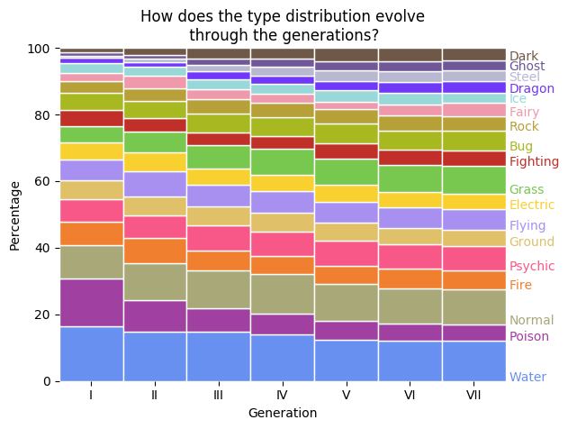

# [Pokémon EDA](https://github.com/chris-winta/Data-Science-Projects/tree/master/Pokemon_EDA)
  An exploratory data analysis of the [complete Pokémon dataset](https://www.kaggle.com/rounakbanik/pokemon) comprising types, base stats, and various other information on 802 Pokémon from 7 generations. The EDA includes:
- **Data cleaning:** Reducing the data set to the relevant features and type conversions
- **Type distributions:** Tracking in visualizing the distributions of Pokémon types throughout the generations

- **Base stats by type:** Exploring the ability base stats and their dependence on type
- **Base stats by generation:** Tracking ability base stats through the generations
- **Base total by legendary status** Checking if the legendary Pokémon are really that legendary
- **Base stat correlations** Exploring correlations between base stats, height and weight
- **(Experimental) Dimensionality reduction**: Simplifying the base stat space using PCA and t-SNE

_Tools: NumPy, Pandas, Matplotlib, Seaborn, scikit-learn_
