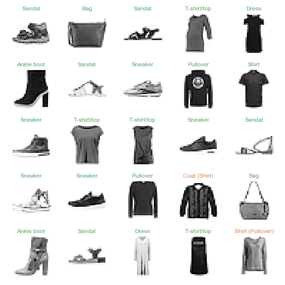

# Data Science Projects
This repository contains the data science projects I've completed or am currently working on.

## Contents

- ### [Pokémon EDA](https://github.com/chris-winta/Data-Science-Projects/tree/master/Pokemon_EDA)
    An exploratory data analysis of the [complete Pokémon dataset](https://www.kaggle.com/rounakbanik/pokemon) comprising types, base stats, and various other information on 802 Pokémon from 7 generations. The EDA includes:
	- **Data cleaning:** Reducing the data set to the relevant features and type conversions
	- **Type distributions:** Tracking in visualizing the distributions of Pokémon types throughout the generations
	
	- **Base stats by type:** Exploring the ability base stats and their dependence on type
	- **Base stats by generation:** Tracking ability base stats through the generations
	- **Base total by legendary status** Checking if the legendary Pokémon are really that legendary
	- **Base stat correlations** Exploring correlations between base stats, height and weight
	- **(Experimental) Dimensionality reduction**: Simplifying the base stat space using PCA and t-SNE

  _Tools: NumPy, Pandas, Matplotlib, Seaborn, scikit-learn_

- ### [Multiclass classification with Fashion-MNIST]()
    Everybody does MNIST, so let's do Fashion-MNIST! A convolutional neural network (CNN) is trained on 60,000 greyscale images of fashion articles from 10 categories. The data is provided by Zalando's [Fashion-MNIST](https://github.com/zalandoresearch/fashion-mnist) dataset. This deep learning excercise includes:
  - **Data preparation:** Loading, exploring, reshaping and normalizing the image data for the deep learning algorithm
  - **Model architecture:** Defining the CNN's architecture using Keras
  - **Model training:** Training the model on 60,000 fashion article images
  - **Model evaluation:** Evaluating the model's performance on 10,000 unknown images and tracking the loss and accuracy as a function of epoch number for further insight
  - **Visualization:** Applying the trained model to the validation dataset and visualizing its predictions
  

  _Tools: NumPy, Pandas, Matplotlib, Seaborn, Keras_
