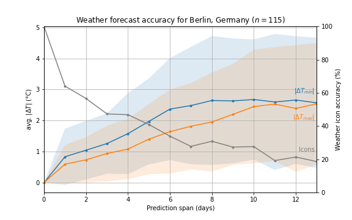

# [Weather Forecast Accuracy](https://github.com/chris-winta/Data-Science-Projects/tree/master/Weather_Forecast_Accuracy)
  In this analysis, I track the accuracy of the 14-days weather forecast for Berlin (Germany) over the course of nearly four months. The goal is to quantify the average discrepancy between predicted and actual temperature as a function of the prediction span. The analysis includes:
- **Data acquisition:** The daily weather forecast data are accessed and stored using a web scraper that is run daily on a Raspberry Pi.
- **Data processing:** The acquired weather data is then loaded and processed for further analysis.
- **Analysis:** Average error and standard deviation are calculated and plotted as a function of the prediction span.

_Tools: BeautifulSoup, cron, NumPy, Pandas, Matplotlib_
