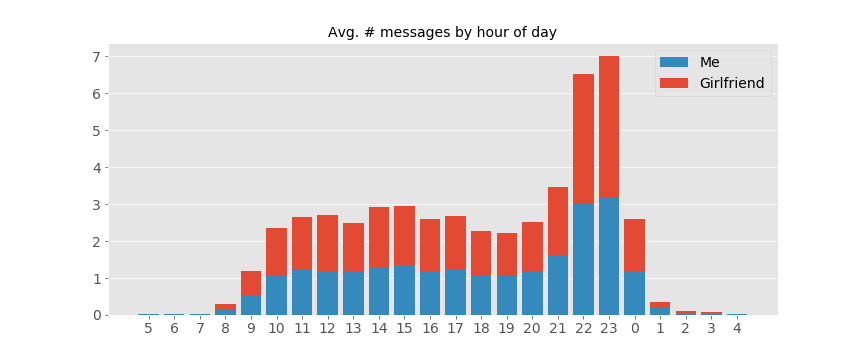

# [WhatsApp Chat Analysis](https://github.com/chris-winta/Data-Science-Projects/tree/master/WhatsApp_Chat_Analysis)
  A text analysis script for WhatsApp chat logs. It extracts statistics and patterns, such as the number of messages sent by each person, average number of words written per hour of day or day of the week as well as the most used words etc. Here, I investigate the messaging behavior between me and my girlfriend over a period of more than two years.
- **Importing the chat log:** Starting from the standard WhatsApp chat log format, the .txt is imported and messages as well as sender's name and timestamps are extracted using a regular expression.
- **Data preparation:** For further analysis a word count is added to each message sent.
- **Basic statistics:** Basic word and message count statistics are acquired and visualized.
- **Hour-of-day statistics:** Grouping all messages by the hour of the day they are sent, reveals peak times and daily patterns.

- **Day-of-week statistic:** Messaging patterns throughout the week are visualized, revealing a different messaging behavior for workdays and weekends.
- **Timeline statistic:** Long-term trends can be investigated by tracking the number of messages over large time-scales, especially with regard to specific events that potentially change the messaging behavior - here: move-in with my girlfriend.
- **Most frequently used words:** A list of the most frequently used words is extracted from the chat history, excluding a set of common, but boring words, such as *and*, *or*, *the*, etc.

_Tools: NumPy, Pandas, Matplotlib, Seaborn, Regular Expressions (re)_
